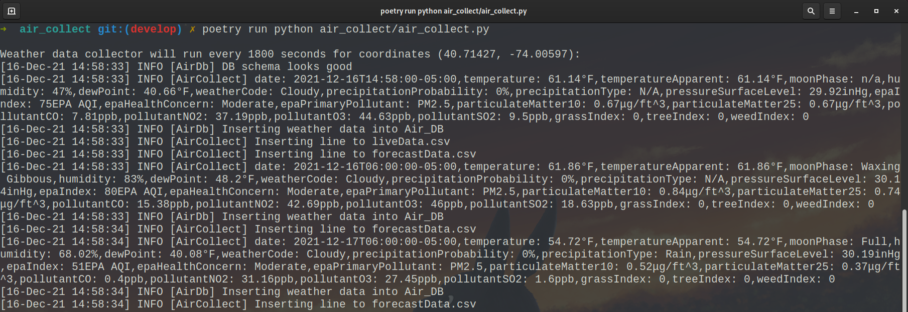

<h1 align="center">air_collect</h1>

<div align="center">
	
</div>

## About
`air_collect` is a simple weather data collector for a single location. The collector stores weather information, using 
the Tomorrow.io Weather API, for a given time interval into a CSV file `liveData.csv` and an SQLite DB of choice.  It 
also updates a 3-day forecast daily into a CSV file `forecastData.csv` and the same SQLite DB.

<div align="center">
	
</div>

## Installation
This project is managed with [Python Poetry](https://github.com/python-poetry/poetry). With Poetry installed correctly,
simply clone this project and run:

```commandline
poetry install
```

To test the project, run:

```commandline
poetry run pytest
```

In order to run the program correctly, see below.

## Introduction
This project functions as part of the larger air project. This particular repository's purpose is
to collect the weather data of a location using the Tomorrow.io Weather API.

### air_collect.py
`air_collect.py` is the process in charge of running continuously, polling the Tomorrow.io
Weather API for weather data. It takes the measurements collected from the API requests outputting them out to
the terminal/logs, and aggregating them in the project's data folder as a collection of CSVs and into an SQLite DB.
This process creates a data file of live weather data readings `liveData.csv`, along with a data file for a 3 day
forecast `forecastData.csv`. 

The SQLite DB file is placed in the given environmental variable path. `air_collect.py`
requires that an `.env` file is available in the *same* directory it is running under. The format of the .env file
should contain ``CLIMATE_CELL_API_KEY``, `QUERY_API_INTERVAL`, `NUM_OF_LIVE_READINGS`, `COORDINATE_LAT`,
`COORDINATE_LONG` and `SQL_LITE_DB` as defined environment values as shown below:

- `CLIMATE_CELL_API_KEY` : The API key of a registered [Tomorrow.io](https://www.tomorrow.io) Weather API account
- `QUERY_API_INTERVAL` : The amount of seconds to wait before querying the API, i.e. polling interval
- `NUM_OF_LIVE_READINGS` : The max number of weather data rows the live data file should hold at any given time. New values continue to be collected indefinitely as long as air_collect.py is run, but the oldest value is consistently truncated to stay within this predefined limit. This does not impact the SQLite DB, as it collects all readings without limits.
- `COORDINATE_LONG` : The location's geographic coordinate system longitude
- `COORDINATE_LAT` : The location's geographic coordinate system latitude
- `SQL_LITE_DB` : File path to SQLite DB file (existing or non-existing)

An explained `.env` file format is shown below:

```commandline
CLIMATE_CELL_API_KEY=<your Tomorrow.io Weather API key>
QUERY_API_INTERVAL=<number of seconds between API requests>
NUM_OF_LIVE_READINGS=<number of readings in the live csv file>
COORDINATES_LAT=<'latitude coordinate>
COORDINATE_LONG=<longitude coordinate>
SQL_LITE_DB=<path to SQLite db file>
```

A typical `.env` file may look like this:

```commandline
CLIMATE_CELL_API_KEY=<your Tomorrow.io Weather API key>
QUERY_API_INTERVAL=3600
NUM_OF_LIVE_READINGS=168
COORDINATES_LAT=40.71427
COORDINATE_LONG=-74.00597
SQL_LITE_DB=/home/white/db/air_db
```

To run the script once the environment file `.env` is created, from within the root air_collect
directory, simply type:

```commandline
poetry run python air_collect/air_collect.py
```

## Data
This data collecting process collects the following data points in the CSV files described above
(`liveData.csv`, `forecastData.csv`) and in the SQLite DB:

```commandline
latitude FLOAT
longitude FLOAT
date TEXT
temp_value FLOAT
temp_apparent_value FLOAT
moon_phase TEXT
humidity_value INTEGER
dew_point_value FLOAT
weather_code TEXT
precipitation_probability_value INTEGER
precipitation_type TEXT
pressure_surface_level_value FLOAT
epa_index_value INTEGER
epa_health_concern TEXT
epa_primary_pollutant TEXT
particulate_matter10_value FLOAT
particulate_matter25_value FLOAT
pollutant_CO_value FLOAT
pollutant_NO2_value FLOAT
pollutant_O3_value FLOAT
pollutant_SO2_value FLOAT
grass_index INTEGER
tree_index INTEGER
weed_index INTEGER
```

## Logs
Process logs are generated in the project's root directory's log folder with the log configuration
existing in the bin folder.

## Commit Conventions
Git commits follow [Conventional Commits](https://www.conventionalcommits.org) message style as
explained in detail on their website.

<br/>
<sup>
    <a href="https://www.flaticon.com/free-icons/cloud-computing" title="cloud-computing icon">
        air_collect icon created by Freepik - Flaticon
    </a>
</sup>
