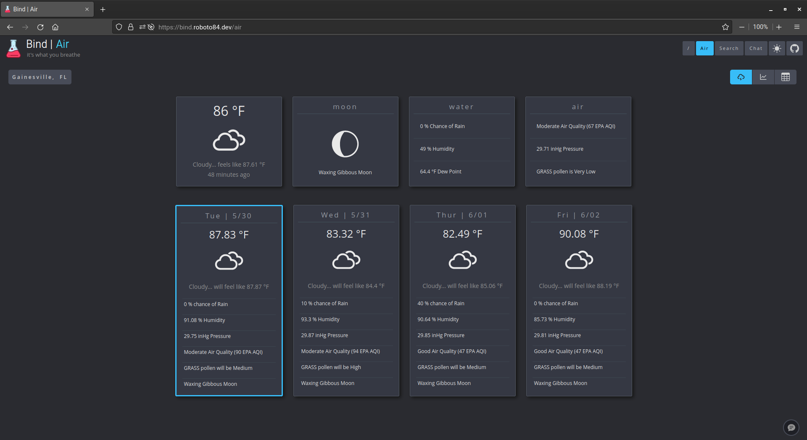

<h1 align="center">air_collect</h1>

<div align="center">
	
</div>

## About
`air_collect` is a simple weather data collector.

Utilizing the [Tomorrow.io Weather API](https://docs.tomorrow.io/reference/welcome), `air_collect` gathers both live and forcasted weather data at specified intervals.

## Install
To see `air_collect` used with **Air** on the `roboto_ui` go to the [roboto](https://github.com/roboto84/roboto) repo and follow its README.

<div align="center">
    
    <br/>
    Air UI on Roboto - dark mode
    <br/><br/>
    
    <br/>
    Air UI on Roboto - light mode
    <br/><br/>
    
    <br/>
    Line graph showing barometric pressure changes over a 2 week interval
    <br/><br/>
    
    <br/>
    Line graph showing temperature changes over a 2 week interval
    <br/><br/>
    
    <br/>
    Hourly weather displayed in a sortable table
    <br/><br/>
</div>


However, if you would like to run `air_collect` outside of `roboto` follow these instructions:

This project is managed with [Poetry](https://github.com/python-poetry/poetry). With Poetry installed, simply clone this project and install its dependencies:

- Clone repo
    ```
    git clone https://github.com/roboto84/air_collect.git
    ```
    ```
    cd air_collect
    ```
- Install dependencies
    ```
    poetry install
    ```

## API Key
`air_collect` requires that you have an API key for [Tomorrow.io](https://docs.tomorrow.io/reference/welcome).

Once you have obtained your API key, you can continue to setting up environmental variables.

## Environmental Variables
- You must create a `.env` file with the following environmental variables set:
    - `CLIMATE_CELL_API_KEY` : The API key of a registered [Tomorrow.io](https://www.tomorrow.io) Weather API account.
    - `QUERY_API_INTERVAL` : The amount of seconds to wait before querying the API, i.e. polling interval.
    - `NUM_OF_LIVE_READINGS` : The max number of weather data rows the live data file should hold at any given time. New values continue to be collected indefinitely as long as air_collect.py is run, but the oldest value is consistently truncated to stay within this predefined limit. This does not impact the SQLite DB, as it collects all readings without limits.
    - `COORDINATE_LONG` : The location's geographic coordinate system longitude.
    - `COORDINATE_LAT` : The location's geographic coordinate system latitude.
    - `SQL_LITE_DB` : File path to SQLite database file (existing or non-existing).


- An explained `.env` file format is shown below:
    ```
    CLIMATE_CELL_API_KEY=<your Tomorrow.io Weather API key>
    QUERY_API_INTERVAL=<number of seconds between API requests>
    NUM_OF_LIVE_READINGS=<number of readings in the live csv file>
    COORDINATE_LAT=<latitude coordinate>
    COORDINATE_LONG=<longitude coordinate>
    SQL_LITE_DB=<path to SQLite db file>
    ```

- A typical `.env` file may look like this:
    ```
    CLIMATE_CELL_API_KEY=gIODELdkqdPDaaLEL1PWOEfQdfAaaeFPq
    QUERY_API_INTERVAL=3600
    NUM_OF_LIVE_READINGS=168
    COORDINATE_LAT=40.71427
    COORDINATE_LONG=-74.00597
    SQL_LITE_DB=/home/white/db/air_db
    ```

## Usage
- Run the collector script once the environment file `.env` is created:
    ```
    poetry run python air_collect/air_collect.py
    ```

<div align="center">
	
    <br/>
    air_collect running
</div>

## Data
This data collecting process collects the following data points in the CSV files described above (`liveData.csv`, `forecastData.csv`) and in the SQLite DB:

```
latitude FLOAT
longitude FLOAT
date TEXT
temp_value FLOAT
temp_apparent_value FLOAT
moon_phase TEXT
humidity_value INTEGER
dew_point_value FLOAT
weather_code TEXT
precipitation_probability_value INTEGER
precipitation_type TEXT
pressure_surface_level_value FLOAT
epa_index_value INTEGER
epa_health_concern TEXT
epa_primary_pollutant TEXT
particulate_matter10_value FLOAT
particulate_matter25_value FLOAT
pollutant_CO_value FLOAT
pollutant_NO2_value FLOAT
pollutant_O3_value FLOAT
pollutant_SO2_value FLOAT
grass_index INTEGER
tree_index INTEGER
weed_index INTEGER
```

## Logs
Process logs are generated in the project's root directory's log folder with the log configuration
existing in the bin folder.

## Commit Conventions
Git commits follow [Conventional Commits](https://www.conventionalcommits.org) message style as explained in detail on their website.

<br/>
<sup>
    <a href="https://www.flaticon.com/free-icons/cloud-computing" title="cloud-computing icon">
        air_collect icon created by Freepik - Flaticon
    </a>
</sup>
